# Product Design
## 4.1. Style Guidelines.

 
En esta sección, el equipo sienta las bases para contar con un repositorio central y organizado de uso común para todo el equipo, que incluye assets, fuentes tipográficas, componentes visuales, entre otros. 
Esto con el fin de mantener una presentación consistente y enfocada de la marca EcoRoad a lo largo de todos los puntos de contacto con el usuario, ya sea en campo, en oficina o en los distintos dispositivos desde los que se accede a la plataforma.

### 4.1.1. General Style Guidelines.

 Construimos la identidad de EcoRoad bajo directrices visuales de Branding, Typography, Colors y Spacing, así como las dimensiones adoptadas para el tono de comunicación y lenguaje aplicado por la marca.
Estas decisiones se sustentan en el posicionamiento de EcoRoad como una plataforma que transforma el monitoreo ambiental en un flujo de gestión de detección de riesgos, alerta, incidencia, acción correctiva y evidencia, por lo que la identidad visual busca transmitir confiabilidad, precisión técnica y una ingeniería civil preventiva y sostenible.

**Branding:**

El logotipo de EcoRoad sintetiza los pilares conceptuales de la propuesta: naturaleza, infraestructura vial y monitoreo ambiental en tiempo real mediante IoT.

* **Hoja (naturaleza/sostenibilidad)**: Representa el componente ambiental que la plataforma monitorea (aire, ruido, agua, vibraciones) y la orientación hacia una gestión vial más sostenible. 
* **Carretera (infraestructura vial)**: Representa el sector de aplicación del producto, construcción, mantenimiento y rehabilitación de vías, transmite avance, trazabilidad y dirección, en línea con el seguimiento de acciones correctivas hasta el cierre de cada incidencia. 
* **Montañas y sol (contexto geográfico y monitoreo)**: Hacen referencia a los tramos, frentes de trabajo y puntos de monitoreo que la plataforma visualiza mediante dashboards geolocalizados. 
* **Contenedor circular**: Refuerza la idea de un ciclo completo de gestión ambiental (monitoreo -> alerta -> incidencia -> acción correctiva -> evidencia -> cierre), coherente con el enfoque preventivo y no solo descriptivo de la plataforma.

**Typography:**

Siguiendo la construcción geométrica y redondeada del logotipo, se adopta una familia tipográfica sans-serif geométrica como base del sistema, priorizando legibilidad en pantallas de campo (tablets, móviles con luz solar directa) y coherencia con el tono técnico y confiable de la marca.

| Uso                        | Tipografía                     | Aplicación |
|:---------------------------|:-------------------------------| :--- |
| Encabezados                | Poppins Bold / SemiBold        | Títulos de dashboard, nombres de proyecto |
| Subtítulos                 | Poppins Medium                 | Nombres de módulos, tarjetas de indicadores |
| Cuerpo de texto            | Inter Regular                  |  Tablas, formularios, descripciones |
| Datos numéricos / métricas | Inter Medium (tabular figures) |Valores de sensores, timestamps |

**Colors:**

La paleta se deriva directamente de los colores institucionales definidos para EcoRoad, con un rol funcional asignado a cada uno para su uso en interfaz:

| Color         | Hex | Rol funcional en la plataforma                                                                                          |
|:--------------| :--- |:------------------------------------------------------------------------------------------------------------------------|
| Verde         | `#2E9E7A` | Color principal de la marca; estado óptimo / sin riesgo detectado (semáforo verde)                                       |
| Azul petróleo | `#264653` | Color secundario; tipografía principal, fondos de navegación, elementos estructurales                                   |
| Crema         | `#F5F1E8` | Fondo base de la interfaz; transmite neutralidad y bajo cansancio visual en uso prolongado                              |
| Amarillo      | `#E9B44C` | Condición de advertencia (semáforo ámbar) — indicador que se acerca al umbral establecido y puede derivar en una alerta |
| Rojo          | `#C0392B` | Condición crítica (semáforo rojo) — el indicador supera el umbral y el sistema genera una incidencia                    |

**Spacing**

Se define un sistema de espaciado en base 8px (8, 16, 24, 32, 40), compatible con grillas de 12 columnas para web y facilitando la futura adaptación a interfaces móviles. 
El espaciado busca priorizar la lectura rápida de indicadores en campo, evitando el amontonamiento de datos en tableros con múltiples proyectos simultáneos.

**Lenguaje de comunicación**

Dado que los usuarios principales (responsables del monitoreo, gestión y atención de incidencias ambientales dentro de empresas constructoras y de conservación/rehabilitación vial) 
operan bajo presión de tiempo en campo y necesitan actuar con rapidez ante un riesgo, el tono de EcoRoad se posiciona de la siguiente manera:

| Posicionamiento                | Justificación |
|:-------------------------------| :--- |
| Serio                          | La plataforma respalda decisiones sobre riesgos ambientales reales en obra; el lenguaje debe transmitir precisión técnica. |
| Formal, con cercanía funcional | Se usa terminología técnica correcta (umbrales, incidencias, acciones correctivas), con instrucciones claras y directas para uso rápido en campo. |
| Respetuoso                     | El lenguaje describe condiciones y acciones sin atribuir culpas; una incidencia se comunica como un hecho a resolver, no como un señalamiento. |
| Sereno                         | Las alertas y notificaciones comunican el nivel de riesgo con claridad, priorizando que el usuario entienda qué acción tomar sobre la urgencia emocional del mensaje. |

### 4.1.2. Web Style Guidelines.

En esta sección se explican e ilustran las decisiones sobre los estándares visuales y de interacción para las interfaces web responsive de EcoRoad, 
aplicables al panel de gestión donde una misma empresa constructora o de conservación/rehabilitación vial, administra sus proyectos, sensores IoT, alertas e incidencias.

* **Grid system:** grilla de 12 columnas con márgenes fluidos, breakpoints en 1280px (desktop), 1024px (tablet/laptop) y 768px (tablet vertical), 
priorizando el desktop como plataforma principal para el análisis multi-proyecto y la vista tablet para el registro de evidencias en campo.
* **Componentes de dashboard:** tarjetas de indicador (KPI cards) con codificación semáforo (verde/amarillo/rojo) según la paleta funcional; 
los dashboards geolocalizados usan el azul petróleo como color base del mapa y marcadores en los tres colores de estado para representar tramos, frentes de trabajo y puntos de monitoreo.
* **Navegación:** barra lateral fija en azul petróleo (
#264653) con el isotipo de EcoRoad, manteniendo contraste alto con el fondo crema (
#F5F1E8) del área de contenido para reducir fatiga visual en sesiones prolongadas de monitoreo.
* **Botones y estados interactivos:** botón primario en verde EcoRoad (
#2E9E7A) para acciones de confirmación (registrar medición, cerrar incidencia); botón de alerta en rojo (
#C0392B) reservado exclusivamente para acciones críticas (crear/escalar una incidencia), evitando el uso decorativo de este color para no diluir su significado funcional.
* **Gestión de incidencias (tipo Kanban):** columnas por estado del flujo de riesgo (Alerta -> Incidencia  -> Acción correctiva -> Evidencia registrada -> Cerrada), 
con tarjetas que muestran responsable asignado, ubicación, fecha/hora y miniatura de evidencia fotográfica, facilitando el seguimiento hasta el cierre.
* **Formularios de registro de campo:** diseñados con campos grandes y espaciado generoso, priorizando el ingreso rápido de mediciones y evidencias 
(foto, descripción, fecha, hora, ubicación) desde dispositivos móviles en obra.
* **Accesibilidad:**  contraste mínimo AA (WCAG 2.1) entre texto y fondo en todas las combinaciones de la paleta, verificado especialmente en el uso del amarillo 
(#E9B44C) sobre crema, que requiere texto oscuro (#264653) para mantener legibilidad.

## 4.2. Information Architecture.

La arquitectura de información de EcoRoad está diseñada para garantizar una navegación fluida, intuitiva y eficiente, permitiendo que tanto los ingenieros de campo (constructoras) como los auditores (supervisoras) accedan con rapidez al valor de la plataforma y a sus herramientas de gestión y fiscalización.

### 4.2.1. Organization Systems.

* **Jerarquía de Contenidos:** La estructura de la información fluye de lo general a lo específico. En la Landing Page pública se prioriza la propuesta de valor HaaS/SaaS y los beneficios de Caiman, mientras que en la Web Application la jerarquía organiza el portafolio global de proyectos viales hasta llegar al detalle micro de cada tramo, punto de monitoreo e incidencia.

* **Secciones Principales de la Aplicación:** La plataforma se divide en módulos funcionales clave:
    * **Dashboard Global:** Vista ejecutiva y multi-proyecto con indicadores de salud ambiental.
    * **Mapa Interactivo:** Visualización geolocalizada de tramos viales y pines semafóricos.
    * **Gestión de Proyectos:** Alta, configuración y administración de frentes de obra viales.
    * **Puntos de Monitoreo:** Registro de telemetría y parámetros físicos (aire, ruido, agua).
    * **Tablero de Incidencias:** Flujo Kanban para el seguimiento y resolución de desvíos normativos con evidencia multimedia.
    * **Reportes y Auditorías:** Generación automatizada de expedientes y exportación en formato PDF.
    * **Configuración y Suscripción:** Gestión de planes (Base, Profesional, Enterprise) y control de accesos basados en roles (RBAC).

* **Agrupación de Contenidos:** Los datos operativos se agrupan lógicamente por severidad y contexto temporal. Las alertas y tickets críticos se destacan mediante códigos de color estandarizados (semáforo), permitiendo un escaneo visual rápido sin saturar al operador de campo.

### 4.2.2. Labeling Systems.

Para asegurar la visibilidad en motores de búsqueda y la correcta compartición en canales digitales B2B, se establecen los siguientes metadatos principales para la experiencia web de EcoRoad:

### 4.2.3. SEO Tags and Meta Tags.

* **Landing Page (Sitio Web Estático):**
    * **Title:** `EcoRoad by Caiman | Monitoreo y Cumplimiento Ambiental en Infraestructura Vial`
    * **Meta Description:** `Plataforma HaaS/SaaS líder en el Perú para la gestión ambiental vial. Automatiza sensores IoT en comodato, alertas de umbrales y reportes de auditoría para constructoras y supervisoras.`
    * **Meta Keywords:** `monitoreo ambiental vial, cumplimiento normativo OEFA MTC, sensores IoT construcción, gestión ambiental carreteras, auditoría ambiental RPA.`
    * **Meta Author:** `Caiman Tech Startup`

* **Web Application (Plataforma Privada):**
    * **Title:** `EcoRoad App | Gestión y Fiscalización Ambiental en Tiempo Real`
    * **Meta Description:** `Panel de control privado para el seguimiento de indicadores ambientales, mapa geolocalizado de tramos viales y resolución de incidencias operativas.`
    * **Meta Keywords:** `dashboard ambiental, tramos viales, tablero kanban incidencias, reportes PDF auditoría.`
    * **Meta Author:** `Caiman Tech Startup`

### 4.2.4. Searching Systems.

* **Barra de Búsqueda Global:** Ubicada de forma prominente en el encabezado principal de la Web Application, permitiendo localizar de inmediato proyectos por nombre o código de tramo vial, puntos de control específicos e incidencias registradas.
* **Filtros y Facetas Contextuales:** Herramientas de acotación de datos dentro de los módulos para filtrar la información por tipo de indicador ambiental (*aire, ruido, agua*), rango de fechas y niveles de severidad del riesgo.
* **Historial de Búsqueda:** Registro automatizado de consultas recientes para agilizar el flujo de trabajo de los auditores y residentes de obra que alternan entre múltiples frentes de trabajo.
* **Resultados Relevantes:** Priorización inteligente de resultados basada en los permisos de usuario (RBAC) y la cartera de proyectos activa asignada a su cuenta.

### 4.2.5. Navigation Systems.

* **Navegación Global:** La barra superior y el menú lateral (*Sidebar*) permanente aseguran el acceso transversal a las secciones principales de la plataforma desde cualquier pantalla del sistema.
* **Navegación Contextual:** Enlaces integrados dentro de las tarjetas de proyectos y botones de acción rápida (*CTAs*) que guían al usuario desde la vista macro del portafolio hasta el detalle analítico de una incidencia o punto de monitoreo.
* **Migas de Pan (Breadcrumbs):** Elementos de rastreo ubicados en la cabecera interna (ej. *Portafolio > Autopista Norte > Tramo 3 > Punto de Control #02*) que indican la ruta de navegación actual y permiten un retroceso jerárquico inmediato.
* **Navegación Móvil:** Adaptación mediante menús colapsables tipo hamburguesa optimizados para pantallas táctiles, asegurando la usabilidad de campo en dispositivos móviles de los ingenieros residentes.

## 4.3. Landing Page UI Design.

4.3.1. Landing Page Wireframe.

El wireframe de nuestra página de inicio sirve como un mapa visual que define la estructura y el flujo de la información. Este esquema asegura una disposición lógica de los componentes, facilitando la navegación y destacando la propuesta de valor de EcoRoad. Las secciones del wireframe están diseñadas para contar una historia completa y persuasiva:

**Hero**

El hero de nuestra plataforma EcoRoad presenta una interfaz limpia e institucional alineada a la supervisión ambiental, destacando con un título directo: "Automated Environmental Compliance & Mitigation for Highway Construction". Una breve descripción que enfatiza el monitoreo en tiempo real y la prevención de multas, acompañada por un botón de llamado a la acción rápida y de alto contraste ("Get Started") que orienta al usuario hacia la conversión. En la parte inferior, una imagen de infraestructura vial que incluye indicadores clave sobre nodos IoT activos y porcentaje de cumplimiento normativo, como un ejemplo de la precisión técnica del sistema.

  

**Solutions**

La sección "Solutions" presenta la oferta de valor mediante un encabezado claro ("Specialized Solutions for the Highway Construction Sector") e introduce una retícula de cuatro tarjetas interactivas que detallan las áreas clave de monitoreo: calidad del aire y polvo, nivel sonoro y ruido, supervisión de recursos hídricos y protección de fauna/hábitats sensibles. Cada tarjeta utiliza un ícono representativo, una breve descripción técnica del proceso automatizado y etiquetas que destacan los estándares normativos o de calibración correspondientes, garantizando una lectura estructurada y fluida de las capacidades de la plataforma, mostrando lo que ofrece la plataforma.

  

**Benefits**

La sección "Benefits" resalta las ventajas competitivas del sistema bajo el título "The EcoRoad Advantage: From Manual Logs to Real-Time Telemetry". Mediante una cuadrícula de cuatro tarjetas con apoyo visual e infográfico, detalla los beneficios clave de la plataforma: prevención de multas y paralizaciones mediante detección preventiva ("Zero Shutdowns & Fines"), consolidación automática de evidencias con encriptación SHA-256 para auditorías ("Automated Audits"), trazabilidad y flujo de trabajo de mitigación inmediata con georreferenciación GPS RTK desde la app offline ("Immediate Mitigation Workflow"), y respaldo legal/técnico continuo frente a inspecciones normativas ("Legal Peace of Mind & Expert Backing"). Cada bloque incluye métricas de impacto que refuerzan la eficiencia operativa y el cumplimiento normativo en obra.

  

**About Us**

La sección "About Us" resalta la propuesta tecnológica bajo el título "Advanced Management & Compliance Technology". Incluye un video explicativo en función de la plataforma junto a un menú interactivo que detalla sus capacidades clave: dashboards GIS georreferenciados, alertas regulatorias automáticas por SMS/WhatsApp/email, cadena de custodia de evidencias con metadatos forenses y exportación en un clic de reportes oficiales en formato PDF/A y GeoJSON.

  

**Testimonials**

La sección presenta ejemplos de experiencias basados en casos de éxito de la plataforma. Muestra testimonios ficticios pero realistas atribuidos a roles clave del sector (directores ambientales, consultores senior y supervisores de obra) para validar el impacto técnico y operacional de EcoRoad ante potenciales clientes.

  

**Pricing**

La sección "Pricing" expone el modelo de monetización bajo el título "Flexible, Scalable Subscription Plans". Estructura la oferta en tres planes SaaS escalables (Base, Professional y Enterprise), permitiendo alternar entre facturación mensual y anual con descuento. Cada tarjeta detalla el precio, el perfil de cliente objetivo, un botón directo de acción y un listado de funcionalidades clave que van desde el monitoreo básico de proyectos hasta integraciones avanzadas y soporte 24/7.

  

**About team**

La sección "About Team" presenta al equipo detrás de la plataforma bajo el título "Driving Innovation and Sustainability in Highway Infrastructure". Incluye un video institucional que muestra el proceso colaborativo del grupo, acompañado por un bloque explicativo que resalta su enfoque multidisciplinario, la combinación de ingeniería de software con sostenibilidad y su visión para transformar el monitoreo ambiental tradicional en una experiencia digital eficiente e intuitiva.

  

**Our team**

La sección "Our Team" presenta a los integrantes del proyecto bajo el título "Meet the multidisciplinary team behind EcoRoad's environmental telemetry platform". Organiza los perfiles en tarjetas individuales que incluyen fotografía, como Software Engineers y una breve descripción profesional centrada en sus habilidades de desarrollo y contribución a la plataforma. Justo debajo, la sección concluye con un banner final de conversión enfocado en la transformación de la sostenibilidad ambiental, ofreciendo botones directos para iniciar o agendar una sesión con un especialista.

  

**Footer**

El Footer (pie de página) de la plataforma cierra el sitio con una estructura institucional sobre fondo oscuro. Se divide en cuatro columnas principales: la primera incluye el logotipo, una breve descripción de la propuesta de valor y el eslogan ("Infrastructure today, a better environment"); las dos siguientes organizan enlaces rápidos hacia los módulos de telemetría y el marco regulatorio/normativo; y la última muestra los canales de contacto, soporte técnico y sedes regionales. En la franja inferior incluye los derechos de autor reservados e información de políticas de privacidad y seguridad de datos.

  

4.3.2. Landing Page Mock-up.

Esta sección presenta los mock-ups de la landing page para versiones web de escritorio y móvil. En ambas se explica la aplicación de los principios de diseño, diseño inclusivo y arquitectura de la información.

**Hero de la aplicación**

El hero de nuestra plataforma EcoRoad presenta una interfaz limpia e institucional alineada a la supervisión ambiental, destacando con un título directo: "Automated Environmental Compliance & Mitigation for Highway Construction". Una breve descripción que enfatiza el monitoreo en tiempo real y la prevención de multas, acompañada por un botón de llamado a la acción rápida y de alto contraste ("Get Started") que orienta al usuario hacia la conversión. En la parte inferior, una imagen de infraestructura vial que incluye indicadores clave sobre nodos IoT activos y porcentaje de cumplimiento normativo, como un ejemplo de la precisión técnica del sistema.

  

**Solutions**

La sección "Solutions" presenta la oferta de valor mediante un encabezado claro ("Specialized Solutions for the Highway Construction Sector") e introduce una retícula de cuatro tarjetas interactivas que detallan las áreas clave de monitoreo: calidad del aire y polvo, nivel sonoro y ruido, supervisión de recursos hídricos y protección de fauna/hábitats sensibles. Cada tarjeta utiliza un ícono representativo, una breve descripción técnica del proceso automatizado y etiquetas que destacan los estándares normativos o de calibración correspondientes, garantizando una lectura estructurada y fluida de las capacidades de la plataforma, mostrando lo que ofrece la plataforma.

  

**Benefits**

La sección "Benefits" resalta las ventajas competitivas del sistema bajo el título "The EcoRoad Advantage: From Manual Logs to Real-Time Telemetry". Mediante una cuadrícula de cuatro tarjetas con apoyo visual e infográfico, detalla los beneficios clave de la plataforma: prevención de multas y paralizaciones mediante detección preventiva ("Zero Shutdowns & Fines"), consolidación automática de evidencias con encriptación SHA-256 para auditorías ("Automated Audits"), trazabilidad y flujo de trabajo de mitigación inmediata con georreferenciación GPS RTK desde la app offline ("Immediate Mitigation Workflow"), y respaldo legal/técnico continuo frente a inspecciones normativas ("Legal Peace of Mind & Expert Backing"). Cada bloque incluye métricas de impacto que refuerzan la eficiencia operativa y el cumplimiento normativo en obra.

  

**About Us**

La sección "About Us" resalta la propuesta tecnológica bajo el título "Advanced Management & Compliance Technology". Incluye un video explicativo en función de la plataforma junto a un menú interactivo que detalla sus capacidades clave: dashboards GIS georreferenciados, alertas regulatorias automáticas por SMS/WhatsApp/email, cadena de custodia de evidencias con metadatos forenses y exportación en un clic de reportes oficiales en formato PDF/A y GeoJSON.

  

**Testimonials**

La sección presenta ejemplos de experiencias basados en casos de éxito de la plataforma. Muestra testimonios ficticios pero realistas atribuidos a roles clave del sector (directores ambientales, consultores senior y supervisores de obra) para validar el impacto técnico y operacional de EcoRoad ante potenciales clientes.

  

**Pricing**

La sección "Pricing" expone el modelo de monetización bajo el título "Flexible, Scalable Subscription Plans". Estructura la oferta en tres planes SaaS escalables (Base, Professional y Enterprise), permitiendo alternar entre facturación mensual y anual con descuento. Cada tarjeta detalla el precio, el perfil de cliente objetivo, un botón directo de acción y un listado de funcionalidades clave que van desde el monitoreo básico de proyectos hasta integraciones avanzadas y soporte 24/7.

  

**About team**

La sección "About Team" presenta al equipo detrás de la plataforma bajo el título "Driving Innovation and Sustainability in Highway Infrastructure". Incluye un video institucional que muestra el proceso colaborativo del grupo, acompañado por un bloque explicativo que resalta su enfoque multidisciplinario, la combinación de ingeniería de software con sostenibilidad y su visión para transformar el monitoreo ambiental tradicional en una experiencia digital eficiente e intuitiva.

  

**Our team**

La sección "Our Team" presenta a los integrantes del proyecto bajo el título "Meet the multidisciplinary team behind EcoRoad's environmental telemetry platform". Organiza los perfiles en tarjetas individuales que incluyen fotografía, como Software Engineers y una breve descripción profesional centrada en sus habilidades de desarrollo y contribución a la plataforma. Justo debajo, la sección concluye con un banner final de conversión enfocado en la transformación de la sostenibilidad ambiental, ofreciendo botones directos para iniciar o agendar una sesión con un especialista.

  

**Footer**

El Footer (pie de página) de la plataforma cierra el sitio con una estructura institucional sobre fondo oscuro. Se divide en cuatro columnas principales: la primera incluye el logotipo, una breve descripción de la propuesta de valor y el eslogan ("Infrastructure today, a better environment"); las dos siguientes organizan enlaces rápidos hacia los módulos de telemetría y el marco regulatorio/normativo; y la última muestra los canales de contacto, soporte técnico y sedes regionales. En la franja inferior incluye los derechos de autor reservados e información de políticas de privacidad y seguridad de datos.

  

4.4. Web Applications UX/UI Design.

4.4.1. Web Applications Wireframes.

**Home**

Muestra el resumen global de la red telemática (proyectos, sensores, alertas e incidentes activos) y el estado general de los proyectos junto con un feed de lecturas recientes fuera de parámetro

  

**Projects**

Ofrece el listado general de obras viales indicando su estado ambiental (óptimo, bajo observación o crítico), cantidad de sensores IoT asociados y métricas de alertas e incidentes

  

**Project Dashboard**

Presenta la vista detallada de un proyecto vial específico con el porcentaje de cumplimiento normativo (ECA), estado de la red de sensores LoRaWAN, lista de incidentes pendientes y los responsables técnicos asignados.

  

**Alerts**

Gestiona las alertas telemáticas preventivas por exceso de parámetros (material particulado, ruido, calidad de agua) y detalla la ubicación, sensor y acción preventiva recomendada en un panel técnico.

  

**Incidents**

Proporciona un tablero Kanban organizado según el estado del flujo de trabajo (Pendiente, En Progreso, Resuelto, Cerrado) para la asignación y gestión operativa de contingencias ambientales.

  

**History**

Grafica la evolución temporal de los indicadores ambientales (como PM10) comparándolos contra los límites normativos del estándar ECA, incluyendo promedios del periodo y simulador de estado sin datos

  

**Reports**

Facilita la configuración y generación de informes oficiales de cumplimiento ambiental exportables en PDF, integrando validación por firma digital y código de seguridad encriptado SHA-256.

  

**Traceability history**

Muestra la secuencia cronológica y la trazabilidad completa de un evento ambiental desde la detección de la alerta hasta el registro de evidencia e implementación de la acción correctiva.

  

**Collaborators**

Permite administrar usuarios y asignar permisos granulares basados en roles (RBAC), incluyendo un área para simular la experiencia de restricciones de acceso según el perfil seleccionado

  

4.4.2. Web Applications Wireflow Diagrams.

4.4.3. Web Applications Mock-ups.

En esta sección se presentan los mock-ups diseñados para la aplicación web de EcoRoad. Cada pantalla responde a las funcionalidades principales del sistema.

**Home**

Panel principal con resumen de red de telemetría, métricas globales (proyectos, sensores, alertas, incidentes) y lista de proyectos activos con tarjetas de alertas recientes en tiempo real.

  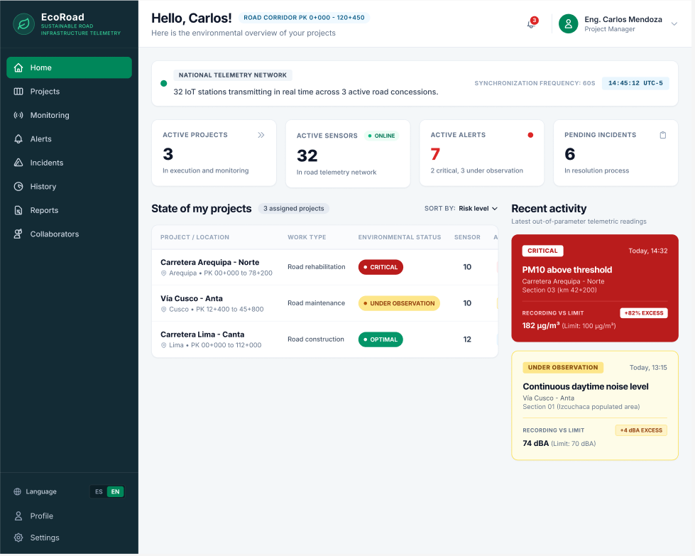

**Projects**

Listado general de obras viales con filtro por estado ambiental (óptimo, observación, crítico), conteo de sensores activos y accesos directos al detalle de cada proyecto

  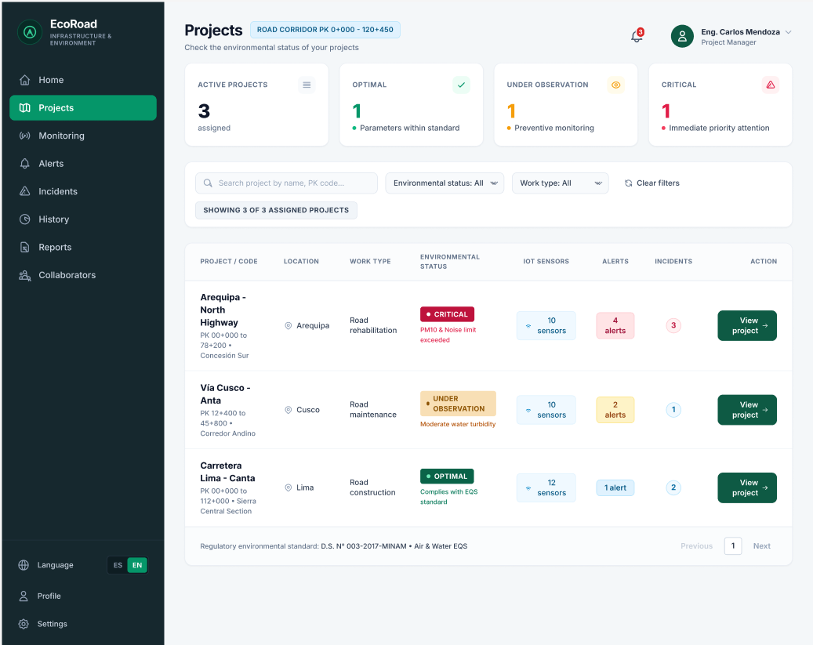

**Project Dashboard**

Vista detallada de un proyecto específico (Carretera Lima-Canta) con porcentaje de cumplimiento normativo, datos de telemetría LoRaWAN, lista de incidentes pendientes y responsables técnicos.

  

**Alerts**

Gestor de alertas preventivas que notifica excesos de parámetros (material particulado, ruido, agua) e incluye un panel técnico con detalles y acciones de mitigación recomendadas.

  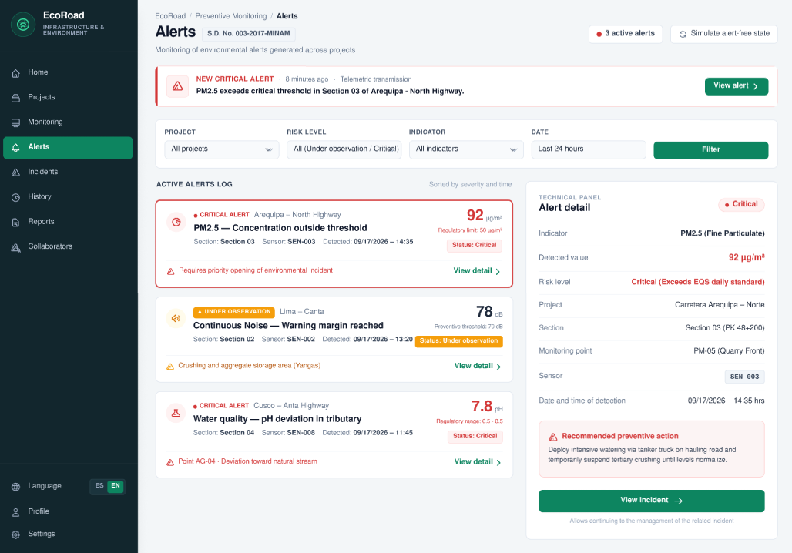

**Incidents**

Tablero tipo Kanban organizado por estado (Pendiente, En Progreso, Resuelto, Cerrado) para la trazabilidad y asignación de responsables en la atención de eventos ambientales.

  

**History**

Gráfico de evolución temporal de indicadores (como PM10) comparados contra los límites normativos del estándar (ECA), con promedios y simulador de estados sin datos

  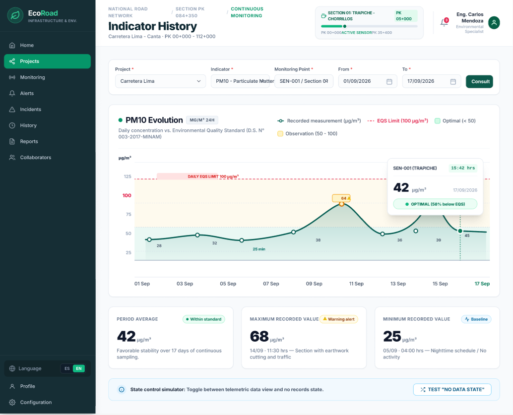

**Reports**

Módulo de generación de informes ambientales oficiales exportables en PDF con validación de firma digital y código de seguridad encriptado SHA-256.

  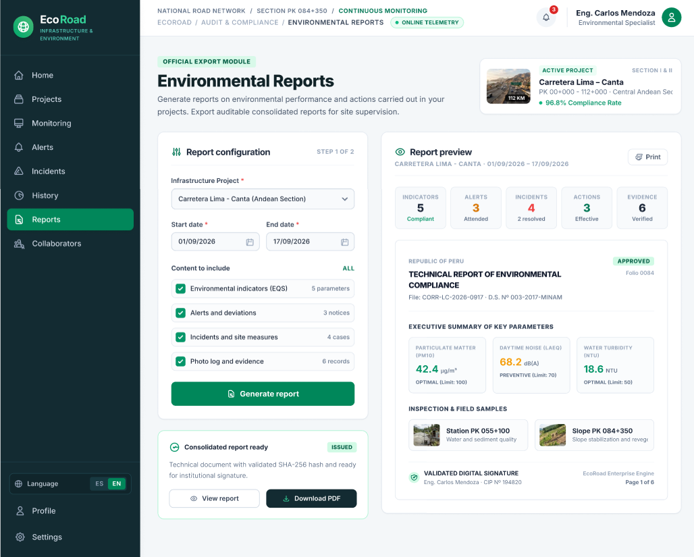

**Collaborators**

Panel de administración de usuarios y permisos (RBAC), con simulación de restricciones de acceso según el perfil técnico asignado.

  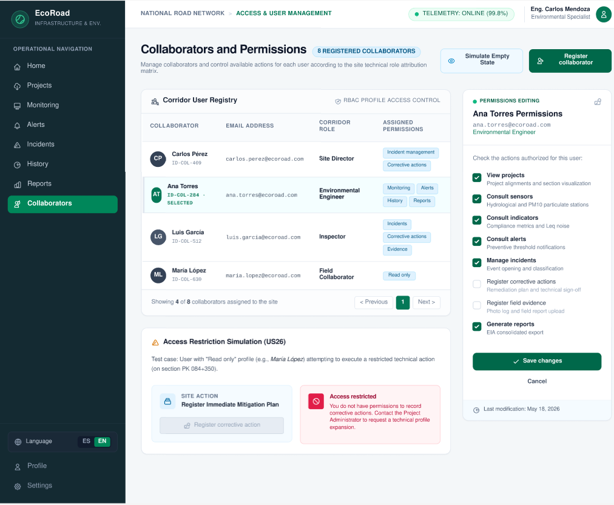

### Mock-ups Version Mobile

**Projects**

Listado vertical de concesiones viales que muestra métricas rápidas de estado ambiental (Critical, Observation, Optimal), sensores, alertas e incidentes por proyecto.

  

**Project Dashboard**

Vista de detalle del proyecto (Carretera Lima–Canta) con porcentaje de cumplimiento normativo (ECA), métricas de red telemática LoRaWAN, incidentes pendientes y profesionales responsables

  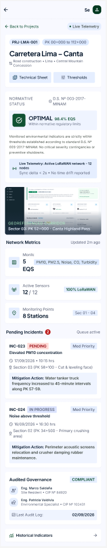

**IoT Sensors**

Panel telemático de red con el mapa/perfil topográfico de nodos, estado de conexión de estaciones y tarjetas de monitoreo en tiempo real por variable (PM10, ruido ambiental).

  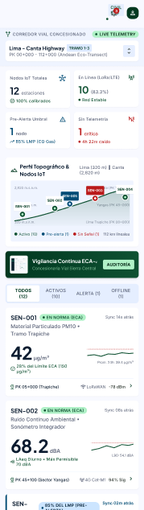

**Alerts**

Gestor móvil de alertas preventivas que notifica desviaciones críticas de parámetros con gráfico de tendencia, protocolo técnico y acciones preventivas recomendadas.

  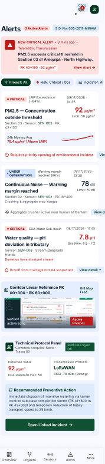

**Environmental Incidents**

Tablero de seguimiento de eventos e incidentes ambientales con filtro por estado (Pending, In Progress, Resolved) y tarjetas para la asignación de responsables en campo.

  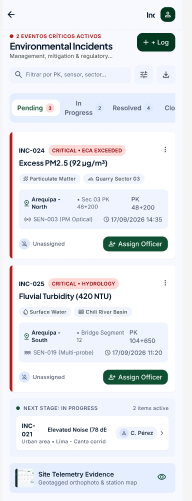

**Traceability History**

Línea de tiempo cronológica (Event Audit Trail) que detalla la trazabilidad desde la alerta inicial hasta el registro de evidencia fotográfica y la acción correctiva aplicada.

  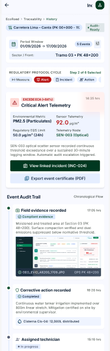

**Indicator History**

Gráfico de evolución temporal de variables (PM10) frente a los límites normativos del ECA, acompañados de promedios, valores máximos/mínimos y certificado de monitoreo.

  

**Environmental Reports**

Configuración y generación de informes oficiales de cumplimiento ambiental con opción de descarga en PDF, vista previa e historial con hash de seguridad SHA-256.

  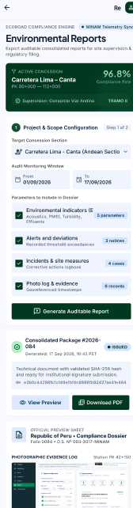

**Collaborators & Permissions**

Administración móvil de personal asignado al corredor y gestor de permisos por rol (RBAC) para el control de lectura, edición y exportación de datos.

  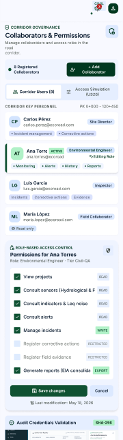

**Subscription & Licensing**

Tarjetas de planes de suscripción (Starter Corridor y Enterprise Concession) que detallan costos, capacidades telemáticas e integración normativa.

  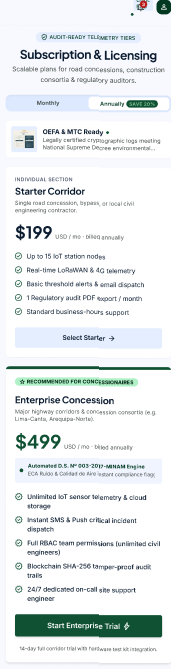

4.4.3. Web Applications User Flow Diagrams.

4.5. Web Applications Prototyping.

4.6. Domain-Driven Software Architecture.

## 4.6. Domain-Driven Software Architecture.

### 4.6.1. Design-Level EventStorming.

**Global**

*Leyenda*
<table align="center">
  <tr>
    <td align="center">
      Aggregate
    </td>
    <td align="center">
      Command
    </td>
    <td align="center">
      Domain Event
    </td>
    <td align="center">
      External System
    </td>
  </tr>
  <tr>
    <td align="center">
      Policy
    </td>
    <td align="center">
      Question / Risk
    </td>
    <td align="center">
      User Actor
    </td>
    <td align="center">
      View / Read Model
    </td>
  </tr>
</table>

**IAM(Identity and Access Management)**

**Project Management**

**Task & Collaboration**

**Governance & Risk**

**Resource & Capacity**

**Document Management**

**Profile Management**

**System Administration**

**Analytics & Reporting**

### 4.6.2. Software Architecture Context Diagram.
El Diagrama de Contexto representa la vista de más alto nivel de EcoRoad, detallando cómo el sistema interactúa con los usuarios y sistemas externos sin profundizar en detalles técnicos.

#### Sistema Central

* **EcoRoad**: Solución integral para la gestión y monitoreo ambiental de proyectos de infraestructura vial, orientada a centralizar la información, detectar riesgos ambientales y facilitar el cumplimiento de las normativas.

#### Usuarios

##### Segmento A: Empresas Constructoras Viales

* Gestionan proyectos de construcción y mantenimiento de carreteras.
* Supervisan las condiciones ambientales de sus proyectos.
* Identifican y atienden riesgos e incidentes ambientales.
* Realizan seguimiento de medidas de mitigación y cumplimiento normativo.

##### Segmento B: Consultoras y Supervisoras Ambientales

* Supervisan el cumplimiento ambiental de múltiples proyectos.
* Realizan inspecciones y monitoreo de indicadores ambientales.
* Validan evidencias y acciones de mitigación.
* Elaboran reportes y dan seguimiento a las incidencias detectadas.

#### Sistemas Externos

* **Servicio de Mapas y Geolocalización**
  Permite visualizar proyectos, puntos de monitoreo e incidencias ambientales mediante información geográfica.

* **Servicio Meteorológico**
  Proporciona información climática que permite relacionar las condiciones ambientales con posibles riesgos dentro de los proyectos.

* **Servicio de Notificaciones**
  Permite enviar alertas automáticas a los responsables cuando se detectan riesgos, incidencias o condiciones que requieren atención.

#### Resumen de Interacción

* Los usuarios (Segmento A y B) interactúan directamente con **EcoRoad**.
* **EcoRoad** centraliza la información ambiental y gestiona:

  * Monitoreo de indicadores ambientales.
  * Registro y seguimiento de incidencias.
  * Acciones de mitigación y responsables.
  * Evidencias y trazabilidad de las actividades.
* **EcoRoad** integra servicios externos para:

  * Geolocalización mediante servicios de mapas.
  * Consulta de condiciones meteorológicas.
  * Envío de notificaciones y alertas.
* Los dispositivos **IoT** pueden enviar datos de sensores ambientales a EcoRoad, permitiendo detectar automáticamente condiciones fuera de los parámetros establecidos y generar alertas o incidencias para su atención.

### 4.6.3. Software Architecture Container Diagrams.
Este nivel desglosa el sistema EcoRoad en aplicaciones y componentes independientes, especificando las tecnologías y responsabilidades principales de cada contenedor que conforma la solución.

Web Application

Aplicación web desarrollada con Vue.js, encargada de proporcionar una interfaz interactiva para empresas constructoras viales y consultoras ambientales.

Permite:

Visualizar dashboards de monitoreo ambiental.
Gestionar proyectos y puntos de monitoreo.
Consultar incidencias y alertas.
Registrar y supervisar acciones de mitigación.
Visualizar información geolocalizada.
Consultar evidencias y generar reportes.

La aplicación se comunica con el backend mediante peticiones HTTPS hacia la API RESTful.

API Application

Construida en C# utilizando ASP.NET Core, constituye el núcleo de EcoRoad y centraliza la lógica de negocio y el procesamiento de la información ambiental.

Este componente se encarga de:

Gestionar proyectos y puntos de monitoreo.
Procesar información proveniente de los dispositivos IoT.
Analizar los valores de los indicadores ambientales.
Comparar los datos recibidos con umbrales configurados.
Generar automáticamente alertas e incidencias.
Gestionar acciones de mitigación y responsables.
Exponer endpoints RESTful para la Web Application.
Integrarse con servicios externos de mapas, clima y notificaciones.
IoT Monitoring

Componente encargado de recibir y gestionar los datos provenientes de sensores ambientales instalados en los proyectos viales.

Los dispositivos IoT pueden monitorear variables como:

Calidad del aire.
Nivel de ruido.
Temperatura.
Humedad.
Calidad del agua.

Los datos recopilados son enviados hacia la API Application, donde son procesados y evaluados según los parámetros ambientales establecidos. Cuando se detecta un valor fuera del rango permitido, EcoRoad puede generar automáticamente una alerta e incidencia para su atención.

Database

Motor de base de datos relacional basado en MySQL, responsable de almacenar de forma persistente la información generada por EcoRoad.

Garantiza:

Integridad de la información de los proyectos.
Persistencia de los datos de monitoreo ambiental.
Registro histórico de incidencias y alertas.
Trazabilidad de las acciones de mitigación.
Almacenamiento de responsables, evidencias y estados.
Consulta histórica para la generación de reportes.

La API Application es responsable de gestionar las operaciones de lectura y escritura sobre la base de datos, evitando que la Web Application acceda directamente a ella.

### 4.6.4. Software Architecture Components Diagrams.

En el nivel de componentes se detalla la descomposición interna de los contenedores de EcoRoad, mostrando los bloques estructurales que conforman la solución y las relaciones entre ellos. Debido a que la Web Application y la Database pueden ser complementadas mediante diagramas específicos de frontend y base de datos, esta sección pone especial énfasis en el contenedor API Application, donde se concentra la lógica de negocio y el procesamiento de la información ambiental.

El diagrama de componentes de la API Application organiza la arquitectura interna de EcoRoad de acuerdo con los principales contextos funcionales del dominio. Cada módulo backend representa un componente encargado de una responsabilidad específica:

Project Management Backend: administra los proyectos viales, sus datos generales, ubicaciones, estados y puntos de monitoreo asociados. Permite crear, consultar, actualizar y gestionar la información de los proyectos.
Environmental Monitoring Backend: procesa y administra los indicadores ambientales registrados en los proyectos, permitiendo consultar mediciones históricas y actuales de variables como calidad del aire, ruido, temperatura, humedad y calidad del agua.
IoT Integration Backend: gestiona la comunicación entre EcoRoad y los dispositivos IoT instalados en los proyectos. Recibe los datos provenientes de los sensores, valida las mediciones y las incorpora al sistema para su posterior análisis.
Risk & Incident Backend: analiza las mediciones ambientales y las compara con los parámetros establecidos. Cuando identifica condiciones que superan los límites permitidos, genera alertas e incidencias ambientales de manera automática.
Mitigation Backend: administra las acciones correctivas y medidas de mitigación asociadas a las incidencias. Permite asignar responsables, establecer fechas límite, actualizar estados y realizar el seguimiento hasta la resolución del problema.
Evidence Backend: gestiona las evidencias relacionadas con inspecciones, incidencias y acciones de mitigación, permitiendo registrar fotografías, documentos y otros archivos que respalden las actividades realizadas.
Reports Backend: centraliza la generación de reportes ambientales y de cumplimiento, utilizando la información almacenada de proyectos, mediciones, incidencias, acciones y evidencias.
Geolocation Backend: administra la información geográfica de proyectos, puntos de monitoreo e incidencias, integrándose con el servicio externo de mapas y geolocalización para representar visualmente la información.
Weather Backend: obtiene información meteorológica mediante el servicio externo correspondiente, permitiendo complementar el análisis de las condiciones ambientales y riesgos asociados a cada proyecto.
Notification Backend: gestiona el envío de alertas y notificaciones a los responsables cuando se generan incidencias, se detectan valores fuera de los parámetros establecidos o existen acciones de mitigación pendientes.
Shared Backend: proporciona componentes comunes, utilidades, validaciones, clases base, manejo de errores y mecanismos de infraestructura reutilizados por los demás módulos de la API.

En el diagrama se refleja cómo:

La Web Application consume los servicios expuestos por los componentes de la API Application mediante endpoints RESTful, permitiendo gestionar proyectos, monitoreo, incidencias, acciones de mitigación, evidencias y reportes.
El IoT Integration Backend recibe las mediciones provenientes del IoT Monitoring, validando y procesando los datos antes de almacenarlos.
El Environmental Monitoring Backend administra las mediciones ambientales y trabaja junto con el Risk & Incident Backend para identificar valores que excedan los umbrales establecidos.
El Risk & Incident Backend genera incidencias automáticamente cuando se detectan condiciones ambientales fuera de los parámetros permitidos y comunica estos eventos al Notification Backend.
El Mitigation Backend gestiona las acciones necesarias para resolver las incidencias, mientras que el Evidence Backend permite registrar evidencias que demuestren el cumplimiento de dichas acciones.
El Project Management Backend, Environmental Monitoring Backend, Risk & Incident Backend, Mitigation Backend, Evidence Backend y Reports Backend acceden a la Database para leer y escribir la información correspondiente a sus responsabilidades.
El Geolocation Backend se integra con el Servicio de Mapas y Geolocalización para obtener información geográfica y representar proyectos, puntos de monitoreo e incidencias.
El Weather Backend se comunica con el Servicio Meteorológico para obtener información climática utilizada como complemento para el monitoreo y análisis de riesgos.
El Notification Backend se integra con el Servicio de Notificaciones para enviar alertas a los responsables de los proyectos.
Todos los componentes backend pueden reutilizar las capacidades proporcionadas por el Shared Backend, favoreciendo la consistencia, reutilización de código y reducción de duplicidad.

De esta manera, el Component Diagram complementa los diagramas de clases y de base de datos de EcoRoad, mostrando cómo la API Application se divide en componentes coherentes con las funcionalidades principales del dominio y cómo estos colaboran entre sí para implementar el monitoreo ambiental, la detección de riesgos, la gestión de incidencias y las acciones de mitigación dentro de los proyectos viales.

## 4.7. Software Object-Oriented Design.

### 4.7.1. Class Diagrams.

Se centra en la definición de diagramas de clases, la interacción entre objetos y la aplicación de principios.

### Bounded Context 1 - Suscriptions and Payment:

### Bounded Context 2 - Identity and Access Management:

### Bounded Context 3 - Project and Road Site Management:

### Bounded Context 4 - Monitoring Asset and Deployment:

### Bounded Context 5 - Environmental Monitoring:

### Bounded Context 6 - Alerting and Risk Evaluation:

### Bounded Context 7 - Incident and Remediation Management:

### Bounded Context 8 - Compliance and Reporting:

## 4.8. Database Design.

### 4.8.1. Database Diagrams.

### Bounded Context 1 - Suscriptions and Payment:

### Bounded Context 2 - Identity and Access Management:

### Bounded Context 3 - Project and Road Site Management:

### Bounded Context 4 - Monitoring Asset and Deployment:

### Bounded Context 5 - Environmental Monitoring:

### Bounded Context 6 - Alerting and Risk Evaluation:

### Bounded Context 7 - Incident and Remediation Management:

### Bounded Context 8 - Compliance and Reporting:

